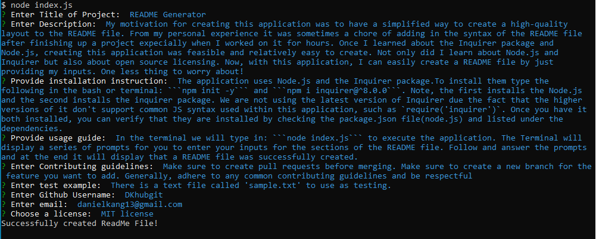

# README Generator

  [](https://opensource.org/licenses/MIT)

  ## Description

  My motivation for creating this application was to have a simplified way to create a high-quality layout to the README file. From my personal experience it was sometimes a chore of adding in the syntax of the README file after finishing up a project expecially when I worked on it for hours. Once I learned about the Inquirer package and Node.js, creating this application was feasible and relatively easy to create. Not only did I learn about Node.js and Inquirer but also about open source licensing. Now, with this application, I can easily create a README file by just providing my inputs. One less thing to worry about!

  ## Table of Contents

  - [Installation](#installation)
  - [Usage](#usage)
  - [Contributing](#contributing)
  - [Tests](#tests)
  - [Questions](#questions)
  - [License](#license)

  ## Installation

  The application uses Node.js and the Inquirer package. To install them type the following in the bash or terminal: 
  ```
  npm init -y
  ``` 
  and 
  ```
  npm i inquirer@^8.0.0
  ```
  Note, the first installs the Node.js and the second installs the inquirer package. We are not using the latest version of Inquirer due the fact that the higher versions of it don't support common JS syntax used within this application, such as 
  ```
  const inquirer = require('inquirer')
  ```
  Once you have it both installed, you can verify that they are installed by checking the package.json file(node.js) and listed under the dependencies.

  ## Usage

  In the terminal we will type in: 
  ```
  node index.js
  ``` 
  to execute the application. The Terminal will display a series of prompts for you to enter your inputs for the sections of the README file. Follow and answer the prompts and at the end it will display that a README file was successfully created.

  

  ## Contributing

  Make sure to create pull requests before merging. Make sure to create a new branch for the feature you want to add. Generally, adhere to any common contributing guidelines and be respectful

  ## Tests 

  There is a text file called 'sample.txt' to use as testing. 
  
  [readme-generator-demo (2).webm](https://user-images.githubusercontent.com/103972201/180123451-a860bffe-03d9-4752-a073-e964f81d892f.webm)

  ## Questions

  GitHub profile: [https://github.com/DKhubgit](https://github.com/DKhubgit)

  Email me at - danielkang13@gmail.com - if you have questions!

  ## License

  Copyright (c) 2022 , DKhubgit
  
  All rights reserved.

  Licensed under the [MIT license](https://opensource.org/licenses/MIT) License.
